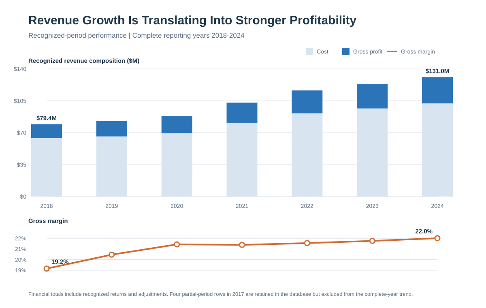

# 1. Revenue and Margin Trend Analysis

## Executive Question

How has recognized revenue and gross margin trended over time, and is revenue growth translating into sustainable profit growth?

## Executive Answer

Yes. From 2018 through 2024, recognized revenue increased every year, rising from **$79.4 million to $131.0 million**. Gross profit grew faster, from **$15.2 million to $28.8 million**, while gross margin expanded from **19.15% to 22.01%**.

The combination of consistent annual revenue growth, faster gross-profit growth, and a 2.86 percentage-point improvement in margin indicates that growth was becoming more profitable through 2024. The main caution is pace: annual revenue growth slowed to about 6% in both 2023 and 2024 after double-digit growth in 2021 and 2022. This looks like maturing growth, not deteriorating economics, because gross profit continued to outpace revenue and margin still expanded.

## Key Findings

- Revenue grew **65.0%** over the six-year interval, an **8.7% compound annual growth rate**.
- Gross profit grew **89.6%**, an **11.3% compound annual growth rate**.
- Cost grew **59.2%**, slower than both revenue and gross profit.
- Gross margin improved **2.86 percentage points**. It expanded in five of six year-over-year comparisons; the only compression was a negligible 0.05 percentage point in 2021.
- Revenue growth peaked at **16.65% in 2021**. In 2024, revenue grew **6.05%** and gross profit grew **7.28%**.
- Seasonality is material: the fourth quarter contributes an average **31.43% of annual revenue**, and December alone contributes **11.70%**. February is the lightest month at **6.40%**.
- Twelve of 72 monthly year-over-year comparisons were negative. The declines were intermittent rather than a sustained multi-month contraction.



## Annual Results

| Year | Revenue | Cost | Gross Profit | Gross Margin | Revenue YoY | Gross Profit YoY | Margin Change |
| ---: | ---: | ---: | ---: | ---: | ---: | ---: | ---: |
| 2018 | $79.4M | $64.2M | $15.2M | 19.15% | - | - | - |
| 2019 | $82.9M | $66.0M | $17.0M | 20.47% | 4.49% | 11.65% | +1.31 pp |
| 2020 | $88.3M | $69.4M | $18.9M | 21.43% | 6.44% | 11.47% | +0.97 pp |
| 2021 | $103.0M | $81.0M | $22.0M | 21.39% | 16.65% | 16.40% | -0.05 pp |
| 2022 | $116.4M | $91.3M | $25.1M | 21.56% | 12.99% | 13.88% | +0.17 pp |
| 2023 | $123.5M | $96.6M | $26.9M | 21.76% | 6.15% | 7.15% | +0.20 pp |
| 2024 | $131.0M | $102.1M | $28.8M | 22.01% | 6.05% | 7.28% | +0.25 pp |

## Business Interpretation

The company is not simply buying top-line growth at the expense of profitability. Revenue, gross profit, and gross margin all end the period materially above their starting levels, and gross profit outgrew revenue by roughly 25 percentage points in total. The near-flat margin in the high-growth year of 2021 is also reassuring: the company absorbed a 16.65% revenue increase without meaningful margin erosion.

The strongest operating watchpoint is the recent slowdown in growth rate. Leadership should distinguish between an expected move toward a more mature 6% growth pace and weakening demand by monitoring revenue growth, gross-profit growth, and margin together. Capacity, purchasing, and cash-flow planning should also account for the fourth-quarter concentration rather than treating each month as equally productive.

Based on the available financial history, the growth pattern appears **profitable and sustainable through 2024**, but this is an analytical conclusion rather than a forecast. No external market, pricing, inflation, or operating-expense data is available to explain the trend or project it forward.

## Method and Assumptions

- `Period` is the financial-reporting authority and is interpreted as YYMM.
- The trend window is `1801` through `2412`, providing seven complete reporting years and 84 consecutive months.
- Four adjustment rows recognized in `1712` remain in the final database but are excluded from the complete-year trend because 2017 contains no other months.
- Revenue is `SUM(Sales)`, cost is `SUM(Cost)`, gross profit is `SUM(Sales - Cost)`, and gross margin is aggregate gross profit divided by aggregate revenue.
- Returns, credits, zero-sales activity, zero-cost activity, and exact-duplicate candidates are retained. No transaction rows inside the reporting window were silently removed.
- Year-over-year comparisons use recognized accounting periods, not invoice dates or order-entry dates.

## Reproducible Queries and Outputs

| Purpose | SQL | Result Table |
| --- | --- | --- |
| Annual trend and year-over-year growth | [`01_revenue_margin_trends.sql`](sql/01_revenue_margin_trends.sql) | [`01_annual_revenue_margin.csv`](outputs/01_annual_revenue_margin.csv) |
| Monthly trend and volatility | [`01_monthly_revenue_margin.sql`](sql/01_monthly_revenue_margin.sql) | [`01_monthly_revenue_margin.csv`](outputs/01_monthly_revenue_margin.csv) |
| Month-of-year seasonality | [`01_revenue_seasonality.sql`](sql/01_revenue_seasonality.sql) | [`01_revenue_seasonality.csv`](outputs/01_revenue_seasonality.csv) |
| Scope and formula reconciliation | [`01_validation_checks.sql`](sql/01_validation_checks.sql) | [`01_validation_checks.csv`](outputs/01_validation_checks.csv) |

The derived summary metrics and chart can be regenerated with:

```bash
python scripts/analyze_q1.py
```

Run this command from the project root after building the final SQLite database.

## Validation Notes

All Question 1 validation checks pass:

- 7 complete reporting years and 84 unique reporting months.
- 3,714,620 in-scope transaction rows.
- All seven years contain exactly 12 recognized periods.
- Stored gross profit reconciles to `Sales - Cost` within one cent in aggregate.
- Annual, monthly, and seasonality result tables reconcile to the same complete-year reporting window.
- The four partial-period 2017 rows are explicitly identified and excluded only from this trend analysis.
