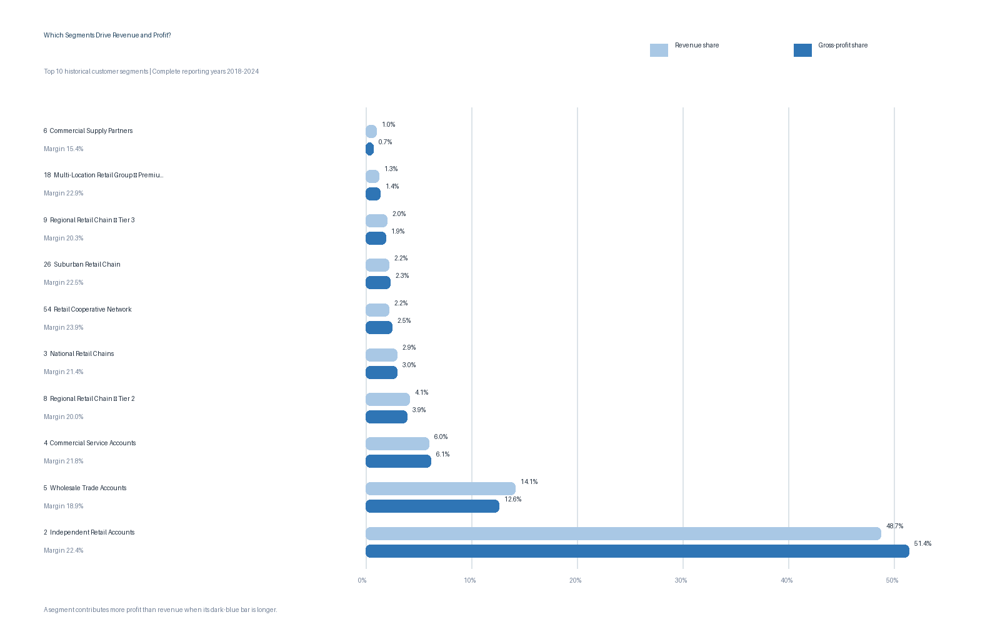

# 1. Customer Segment Profitability

## Executive Question

Which customer segments bring in the most revenue and gross profit, and which segments earn stronger or weaker margins?

## Executive Answer

**Independent Retail Accounts** is the company's most important segment by a wide margin. From 2018 through 2024, it generated **$353.1 million of revenue** and **$79.1 million of gross profit**. That equals **48.75% of company revenue** and **51.37% of company gross profit**, with a **22.39% gross margin**.

This is a good result: the segment contributes a slightly larger share of profit than revenue. The company should protect these customer relationships while avoiding too much dependence on one type of customer. Wholesale Trade is also large, but its lower margin deserves attention. Several smaller segments have strong margins and may offer room for focused growth.

## Key Findings

- **Independent Retail Accounts** generated 48.75% of revenue and 51.37% of gross profit at a 22.39% margin.
- **Wholesale Trade Accounts** ranked second with $102.3 million of revenue, but its 18.94% margin produced 14.12% of revenue and only 12.59% of gross profit.
- Independent Retail, Wholesale Trade, and Commercial Service together produced **63.58% of the company's 2018-2024 revenue increase**.
- **Retail Cooperative Network** grew quickly: 2024 revenue was 111.18% above 2018, gross profit was 167.59% higher, and margin rose from 20.05% to 25.40%.
- Among segments representing at least 0.5% of revenue, **Independent Distribution Partner** had the strongest historical margin at 24.15%, while **Niche Specialty Retailer** had the weakest at 14.88%.
- Mid-Size Retail Chain and Regional Retail Chain - Tier 1 had no recognized revenue in 2024. Their combined 2018 revenue was $2.7 million, so the decline matters but did not outweigh growth elsewhere.



## Largest Historical Segments

| Rank | Customer segment | Revenue | Gross profit | Margin | Revenue share | GP share |
| ---: | --- | ---: | ---: | ---: | ---: | ---: |
| 1 | Independent Retail Accounts | $353.1M | $79.1M | 22.39% | 48.75% | 51.37% |
| 2 | Wholesale Trade Accounts | $102.3M | $19.4M | 18.94% | 14.12% | 12.59% |
| 3 | Commercial Service Accounts | $43.1M | $9.4M | 21.85% | 5.95% | 6.12% |
| 4 | Regional Retail Chain - Tier 2 | $30.0M | $6.0M | 19.98% | 4.14% | 3.89% |
| 5 | National Retail Chains | $21.4M | $4.6M | 21.44% | 2.95% | 2.98% |
| 6 | Retail Cooperative Network | $15.9M | $3.8M | 23.91% | 2.20% | 2.47% |
| 7 | Suburban Retail Chain | $15.7M | $3.5M | 22.51% | 2.17% | 2.30% |

## Business Interpretation

Independent Retail is large and profitable. Its gross-profit share is higher than its revenue share, so the company is not sacrificing margin to keep that business. The practical next step is to protect service, product availability, and customer relationships in this segment while continuing to watch how much of the company depends on it.

Wholesale Trade tells a different story. It brings in a great deal of revenue, but its margin is below the company average. Because the segment is already large, even a modest improvement in pricing, purchasing, freight recovery, or account mix could add meaningful gross profit.

Retail Cooperative Network and Independent Distribution Partner are smaller, but their margins are strong. They are reasonable places to test focused growth efforts. The company should test those opportunities rather than assuming every high-margin segment can grow at the same rate.

These results use the customer class recorded on each transaction. Customers can be reclassified over time, so the analysis reflects both changes in customer activity and changes in the way customers were classified.

## Method and Assumptions

- The reporting window is `1801` through `2412`, covering 84 complete months.
- The customer class stored on each transaction is used for historical reporting. Current customer classifications do not rewrite prior activity.
- Gross margin is calculated from total segment revenue and cost, not by averaging row-level margins.
- Segment growth compares full-year 2018 with full-year 2024. Percentage growth is left blank when the 2018 starting value is zero.
- Margin comparisons labeled material include segments with at least 0.5% of total recognized revenue.

## Reproducible Queries and Outputs

| Purpose | SQL | Result table |
| --- | --- | --- |
| Historical segment revenue and profitability | [`01_segment_profitability.sql`](sql/01_segment_profitability.sql) | [`01_segment_profitability.csv`](outputs/01_segment_profitability.csv) |
| 2018-to-2024 segment growth | [`01_segment_growth.sql`](sql/01_segment_growth.sql) | [`01_segment_growth.csv`](outputs/01_segment_growth.csv) |
| Scope and reconciliation checks | [`01_validation_checks.sql`](sql/01_validation_checks.sql) | [`01_validation_checks.csv`](outputs/01_validation_checks.csv) |

Regenerate the outputs and chart with:

```bash
python scripts/analyze_q1.py
```

## Validation Notes

All Question 1 checks pass: 64 active historical segments, 84 recognized reporting months, revenue and gross profit reconciled to the final transaction table within one cent, and no transaction rows with an unmapped customer class.
