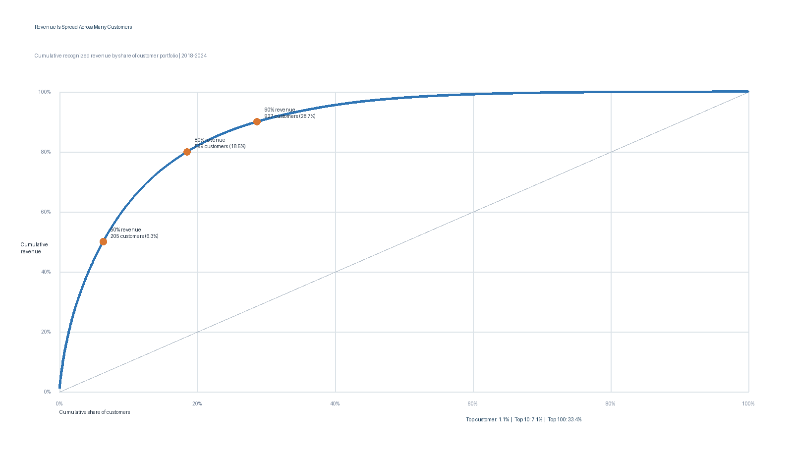

# 2. Revenue Concentration

## Executive Question

Does the company depend too heavily on a small number of customers or customer segments?

## Executive Answer

The company is **not heavily dependent on a few individual customers**. Its largest customer represents only **1.13%** of recognized revenue. The top 10 represent **7.09%**, and the top 100 represent **33.41%**. It takes **599 customers, or 18.54% of all customers, to reach 80% of revenue**.

The segment results are more concentrated. Independent Retail Accounts alone represents 48.75% of revenue, the top three segments represent 68.82%, and seven of 64 segments are enough to reach 80%. Losing one large customer would be manageable. A problem affecting an entire customer segment would be more serious.

## Key Findings

- Largest customer revenue share: **1.13%**.
- Top 10 customer revenue share: **7.09%**.
- Top 100 customer revenue share: **33.41%**.
- **205 customers (6.35%)** generate 50% of revenue.
- **599 customers (18.54%)** generate 80% of revenue.
- **927 customers (28.70%)** generate 90% of revenue.
- Customer-level HHI is **19.36**, compared with **2,662.59** at the segment level. HHI is used only to compare the two types of concentration; it is not a regulatory market test.
- Of 3,230 customer IDs, 3,192 have positive net revenue, 17 are net zero, and 21 are net negative because returns and credits remain in the data.



## Concentration Summary

| Measure | Customer level | Segment level |
| --- | ---: | ---: |
| Largest entity share | 1.13% | 48.75% |
| Top 3 share | 2.97% | 68.82% |
| Top 5 share | 4.31% | 75.91% |
| Entities needed for 80% of revenue | 599 | 7 |
| HHI | 19.36 | 2,662.59 |

The customer results are close to an 80/20 pattern: 18.54% of customers generate 80% of revenue. Even so, the company is not controlled by a handful of accounts. The many smaller customers add diversification, although servicing a long list of small accounts may also require more time and effort.

## Business Interpretation

The loss of one customer would not put a large share of revenue at risk. The biggest customer represents only 1.13%, so the company does not need to build its strategy around fear of losing a single account.

The larger concern is the Independent Retail segment. Nearly half of company revenue comes from customers in that group. If many of those customers faced the same problem at once, such as weaker demand, stronger competition, pricing pressure, or service issues, the effect could be much larger than losing one account.

The company should continue reviewing its largest customers, but it should also track revenue, margin, active-customer count, and retention by segment. That view is more likely to reveal a broad risk early.

Customers with net-negative revenue remain in the calculation. This can cause the cumulative percentage to move slightly after all positive-revenue customers have been counted, but it keeps returns and credits in the financial record instead of quietly removing them.

## Method and Assumptions

- Customers are ranked using net recognized revenue from `1801` through `2412`.
- Returns, credits, and net-negative customer totals remain in the analysis.
- Public result files use stable anonymized customer labels rather than source customer numbers.
- Revenue shares use total company net recognized revenue as the denominator.
- Customers are ranked from highest to lowest net revenue.
- Segment concentration uses the historical class stored on each transaction.

## Reproducible Queries and Outputs

| Purpose | SQL | Result table |
| --- | --- | --- |
| Ranked customer concentration | [`02_customer_concentration.sql`](sql/02_customer_concentration.sql) | [`02_customer_concentration.csv`](outputs/02_customer_concentration.csv) |
| Concentration thresholds and HHI | [`02_concentration_summary.sql`](sql/02_concentration_summary.sql) | [`02_concentration_summary.csv`](outputs/02_concentration_summary.csv) |
| Segment-level comparison | [`02_segment_concentration.sql`](sql/02_segment_concentration.sql) | [`02_segment_concentration.csv`](outputs/02_segment_concentration.csv) |
| Reconciliation checks | [`02_validation_checks.sql`](sql/02_validation_checks.sql) | [`02_validation_checks.csv`](outputs/02_validation_checks.csv) |

Regenerate the outputs and chart with:

```bash
python scripts/analyze_q2.py
```

## Validation Notes

All Question 2 checks pass: 3,230 unique customers, one revenue rank per customer, customer revenue reconciled to the final transaction table within one cent, final cumulative revenue equal to 100.0000%, and largest-customer share below the two-percent reasonableness threshold.
