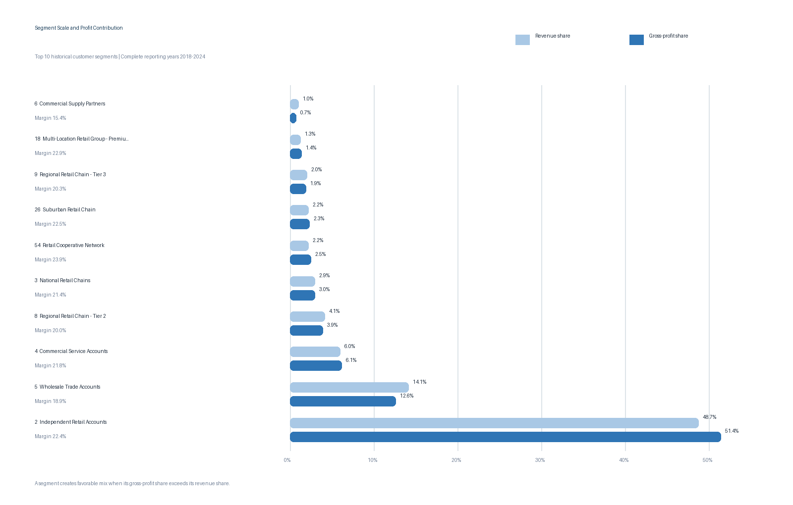

# 2. Customer Segment Profitability

## Executive Question

Which customer segments drive profitable growth, and are the highest-revenue segments also the highest-margin segments?

## Executive Answer

The largest segment is also economically attractive, but revenue rank and margin rank are not interchangeable. **Independent Retail Accounts** generated **$353.1 million** of recognized revenue and **$79.1 million** of gross profit from 2018 through 2024. That is **48.75% of revenue**, **51.37% of gross profit**, and a **22.39% gross margin**.

The segment therefore produces slightly more than its proportional share of profit. It also contributed **43.04% of total company revenue growth** between 2018 and 2024 while expanding margin from **20.55% to 23.12%**. The company should protect this core, but its scale creates segment-level dependency. Smaller high-margin segments offer selective expansion opportunities, while several material low-margin segments warrant pricing and cost-to-serve review.

## Key Findings

- **Independent Retail Accounts** is the clear economic engine: 48.75% of revenue and 51.37% of gross profit at a 22.39% margin.
- **Wholesale Trade Accounts** ranks second with $102.3 million of revenue, but its 18.94% margin leaves it revenue-heavy and profit-light: 14.12% of revenue versus 12.59% of gross profit.
- The top three growth contributors—Independent Retail, Wholesale Trade, and Commercial Service—generated **63.58% of the company’s 2018–2024 revenue increase**.
- **Retail Cooperative Network** is a promising scale-up candidate: 2024 revenue was 111.18% above 2018, gross profit was 167.59% higher, and margin improved from 20.05% to 25.40%.
- Among segments representing at least 0.5% of total revenue, **Independent Distribution Partner** has the strongest historical margin at 24.15%; **Niche Specialty Retailer** is weakest at 14.88%.
- Mid-Size Retail Chain and Regional Retail Chain – Tier 1 each fell to zero recognized revenue in 2024. Their combined 2018 revenue was $2.7 million, so the decline is important but not large enough to offset growth in the core segments.



## Largest Historical Segments

| Rank | Customer segment | Revenue | Gross profit | Margin | Revenue share | GP share |
| ---: | --- | ---: | ---: | ---: | ---: | ---: |
| 1 | Independent Retail Accounts | $353.1M | $79.1M | 22.39% | 48.75% | 51.37% |
| 2 | Wholesale Trade Accounts | $102.3M | $19.4M | 18.94% | 14.12% | 12.59% |
| 3 | Commercial Service Accounts | $43.1M | $9.4M | 21.85% | 5.95% | 6.12% |
| 4 | Regional Retail Chain – Tier 2 | $30.0M | $6.0M | 19.98% | 4.14% | 3.89% |
| 5 | National Retail Chains | $21.4M | $4.6M | 21.44% | 2.95% | 2.98% |
| 6 | Retail Cooperative Network | $15.9M | $3.8M | 23.91% | 2.20% | 2.47% |
| 7 | Suburban Retail Chain | $15.7M | $3.5M | 22.51% | 2.17% | 2.30% |

## Business Interpretation

The portfolio has one dominant segment, but that segment is not buying volume through weak economics. Independent Retail’s gross-profit share exceeds its revenue share, and its margin improved as it scaled. The most important near-term action is therefore defensive growth: maintain service, availability, and pricing discipline for the core without allowing nearly half of company revenue to become a single-segment blind spot.

Wholesale Trade and several other material segments deserve margin diagnostics. Their size means that modest improvements in price realization, purchasing, freight recovery, or account mix could create more value than aggressive expansion of a very small high-margin segment. Conversely, high-margin groups such as Retail Cooperative Network and Independent Distribution Partner should be tested for repeatable acquisition opportunities.

The growth comparison includes historical customer reclassification effects because the transaction’s class is treated as the financial-history authority. Changes therefore reflect the reported segment mix as well as underlying customer activity; they should not be interpreted as a pure same-customer migration study.

## Method and Assumptions

- The reporting window is `1801` through `2412`, the same 84 complete months used in Question 1.
- The customer class recorded on each transaction is the historical reporting authority. Current customer classifications do not overwrite prior-period activity.
- Gross margin is calculated from aggregate revenue and aggregate cost, not as an average of row-level margins.
- Segment growth compares full-year 2018 with full-year 2024. New segments have a blank percentage-growth value when the 2018 base is zero.
- “Material” margin comparisons use segments with at least 0.5% of total recognized revenue so extremely small segments do not dominate the ranking.

## Reproducible Queries and Outputs

| Purpose | SQL | Result table |
| --- | --- | --- |
| Historical segment scale and profitability | [`02_segment_profitability.sql`](sql/02_segment_profitability.sql) | [`02_segment_profitability.csv`](outputs/02_segment_profitability.csv) |
| 2018-to-2024 segment growth | [`02_segment_growth.sql`](sql/02_segment_growth.sql) | [`02_segment_growth.csv`](outputs/02_segment_growth.csv) |
| Scope and reconciliation checks | [`02_validation_checks.sql`](sql/02_validation_checks.sql) | [`02_validation_checks.csv`](outputs/02_validation_checks.csv) |

Regenerate the outputs and visualization with:

```bash
python scripts/analyze_q2_q4.py
```

## Validation Notes

All Question 2 checks pass: 64 active historical segments, 84 recognized reporting months, revenue and gross profit reconciled to the final transaction table within one cent, and zero transaction rows with an unmapped customer class.
