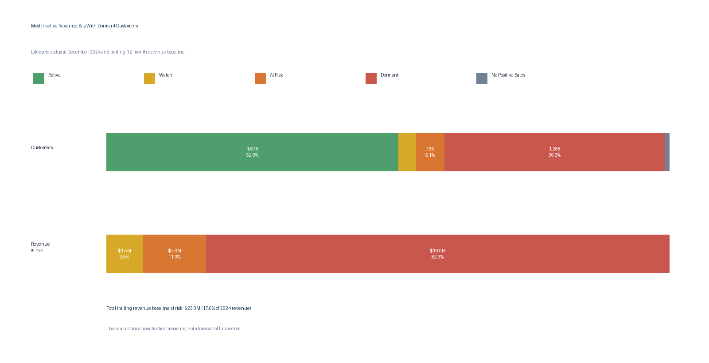

# 3. Customer Lifecycle and Retention Risk

## Executive Question

Which customers appear inactive, and how much recent historical revenue is connected to those customers?

## Executive Answer

At December 2024, **1,678 customers (51.95%)** had a positive sale in the previous three months and were classified as active. Another **263 customers (8.14%)** were in the watch or at-risk groups. The dormant group is large at **1,268 customers (39.26%)**, but the revenue connected to each customer matters more than the customer count alone.

Non-active customers carry a **$23.0 million trailing revenue baseline**, equal to **17.60% of 2024 revenue**. Dormant customers account for **$19.0 million, or 82.27%, of that amount**. This is a historical measure used to prioritize possible outreach. It is not a forecast of future losses and it does not prove that a customer has permanently left.

## Lifecycle Summary

| Lifecycle status | Customers | Customer share | Revenue at risk | Share of risk | Share of 2024 revenue |
| --- | ---: | ---: | ---: | ---: | ---: |
| Active (0-3 months) | 1,678 | 51.95% | $0.0M | 0.00% | 0.00% |
| Watch (4-6 months) | 98 | 3.03% | $1.5M | 6.47% | 1.14% |
| At Risk (7-12 months) | 165 | 5.11% | $2.6M | 11.26% | 1.98% |
| Dormant (13+ months) | 1,268 | 39.26% | $19.0M | 82.27% | 14.48% |
| No Positive Sales | 21 | 0.65% | $0.0M | 0.00% | 0.00% |



## Segment Priorities

| Customer segment | Risky customers | Risky share of segment | Revenue at risk | Share of risk |
| --- | ---: | ---: | ---: | ---: |
| Independent Retail Accounts | 767 | 46.94% | $9.8M | 42.71% |
| Commercial Service Accounts | 290 | 62.50% | $3.5M | 15.08% |
| Wholesale Trade Accounts | 162 | 45.38% | $2.7M | 11.50% |
| Mid-Size Retail Chain | 30 | 100.00% | $1.5M | 6.43% |
| Regional Retail Chain - Tier 1 | 16 | 100.00% | $1.0M | 4.31% |

The first three segments account for **69.29% of the historical revenue baseline at risk**. The first outreach group should include high-value customers inactive for 7-12 months. The largest dormant customers can be tested separately for possible reactivation.

## Business Interpretation

The dormant count looks alarming at first, but contacting all 1,268 dormant customers would not be a good use of time. Some customers were small, some may have closed, and others may buy only occasionally. Outreach should start with customers that were valuable and became inactive recently.

Customers in the 7-12 month group should receive the most immediate attention because their buying history is recent. Customers in the 4-6 month watch group can receive lower-cost reminders before the gap becomes longer. Dormant customers should be handled as a smaller test focused on the accounts with the largest historical revenue.

A return or credit does not count as new activity. Only a positive sale resets the inactivity clock. This prevents an accounting adjustment from making a customer look active.

Inactivity is not the same as confirmed churn. Seasonal buying, planned purchasing cycles, mergers, customer reclassification, or the end of the available data can all make a customer appear inactive.

## Method and Assumptions

- Lifecycle status is measured relative to the latest recognized period, `2412`.
- Active: 0-3 months since the last positive sale; Watch: 4-6; At Risk: 7-12; Dormant: 13 or more; No Positive Sales: no positive-sale period in the reporting window.
- Revenue at risk is the customer's net recognized revenue during the 12 periods ending with the last positive-sale period. It is floored at zero and assigned only to non-active customers.
- Segment reporting uses the historical class with the most positive revenue in the customer's last active period.
- Current customer-master classifications do not overwrite historical transactions.

## Reproducible Queries and Outputs

| Purpose | SQL | Result table |
| --- | --- | --- |
| Customer-level lifecycle table | [`03_customer_lifecycle.sql`](sql/03_customer_lifecycle.sql) | [`03_customer_lifecycle.csv`](outputs/03_customer_lifecycle.csv) |
| Lifecycle and revenue-at-risk summary | [`03_retention_summary.sql`](sql/03_retention_summary.sql) | [`03_retention_summary.csv`](outputs/03_retention_summary.csv) |
| Segment-level retention risk | [`03_retention_by_segment.sql`](sql/03_retention_by_segment.sql) | [`03_retention_by_segment.csv`](outputs/03_retention_by_segment.csv) |
| Prioritized 7-12 month outreach list | [`03_priority_outreach.sql`](sql/03_priority_outreach.sql) | [`03_priority_outreach.csv`](outputs/03_priority_outreach.csv) |
| Lifecycle validation checks | [`03_validation_checks.sql`](sql/03_validation_checks.sql) | [`03_validation_checks.csv`](outputs/03_validation_checks.csv) |

Regenerate the outputs and chart with:

```bash
python scripts/analyze_q3.py
```

## Validation Notes

All Question 3 checks pass: latest period `2412`, one lifecycle record for each of 3,230 customers, lifecycle groups reconciled to the customer population, 21 customers correctly isolated with no positive sales, no revenue-at-risk assigned to active customers, and no negative revenue-at-risk values.
