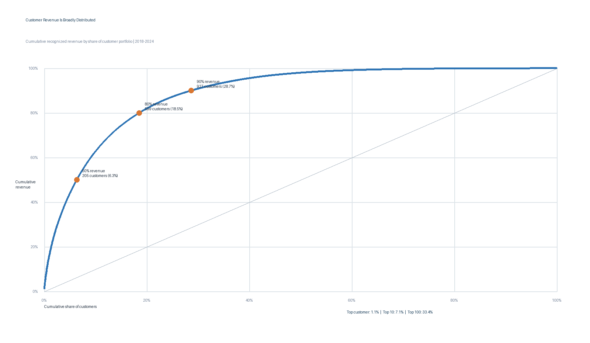

# 3. Revenue Concentration Risk

## Executive Question

Is the business overly dependent on a small group of customers, and how does concentration differ at the customer and segment levels?

## Executive Answer

The company is **not dependent on a handful of individual customers**, but it is meaningfully concentrated in one customer segment. The largest customer represents only **1.13%** of recognized revenue; the top 10 represent **7.09%**, and the top 100 represent **33.41%**. It takes **599 customers, or 18.54% of the portfolio, to reach 80% of revenue**.

At the segment level, the pattern is materially different. Independent Retail Accounts alone represents 48.75% of revenue, the top three segments represent 68.82%, and only seven of 64 segments are needed to reach 80%. Leadership should therefore monitor common segment risks—pricing pressure, channel disruption, competitive shifts, or service failures—more closely than the loss of any single account.

## Key Findings

- Largest customer revenue share: **1.13%**.
- Top 10 customer revenue share: **7.09%**.
- Top 100 customer revenue share: **33.41%**.
- **205 customers (6.35%)** generate 50% of revenue.
- **599 customers (18.54%)** generate 80% of revenue.
- **927 customers (28.70%)** generate 90% of revenue.
- Customer-level HHI is **19.36**, while segment-level HHI is **2,662.59**. HHI is used here as a comparative concentration indicator, not a regulatory market-concentration test.
- Of 3,230 customer IDs, 3,192 have positive net recognized revenue, 17 are net zero, and 21 are net negative because credits and returns are retained.



## Concentration Summary

| Measure | Customer level | Segment level |
| --- | ---: | ---: |
| Largest entity share | 1.13% | 48.75% |
| Top 3 share | 2.97% | 68.82% |
| Top 5 share | 4.31% | 75.91% |
| Entities needed for 80% of revenue | 599 | 7 |
| HHI | 19.36 | 2,662.59 |

The customer portfolio is approximately Pareto-like at the 80% threshold—18.54% of customers generate 80% of recognized revenue—but it is not dominated by a few individual accounts. The long tail provides diversification and prospecting opportunity, although it may create operating complexity if low-value accounts consume disproportionate service effort.

## Business Interpretation

Customer-specific loss risk is manageable: even the largest account would affect only 1.13% of historical revenue. A top-account coverage plan is still appropriate, but broad account loss should not be the central strategic fear.

The more important exposure is correlated segment behavior. Nearly half of revenue comes from Independent Retail Accounts, so a segment-wide change in demand, competition, pricing, or fulfillment quality could affect many customers at once. Leadership should pair account-level monitoring with a segment dashboard that tracks growth, gross margin, active-customer count, retention status, and share of company revenue.

Because net-negative customers are retained, cumulative percentages can move slightly after the positive-revenue population has been exhausted. That behavior is mathematically correct for the complete ledger and prevents credits from being silently discarded.

## Method and Assumptions

- Customer IDs are ranked using net recognized revenue from `1801` through `2412`.
- Credits, returns, and net-negative customer totals remain in the analysis.
- Customer names and source customer numbers are not required for concentration measurement; the public output uses anonymized customer labels.
- Revenue shares use company net recognized revenue as the denominator.
- The cumulative curve ranks customers from highest to lowest net revenue.
- Segment concentration uses the historical class recorded on each transaction.

## Reproducible Queries and Outputs

| Purpose | SQL | Result table |
| --- | --- | --- |
| Ranked customer concentration curve | [`03_customer_concentration.sql`](sql/03_customer_concentration.sql) | [`03_customer_concentration.csv`](outputs/03_customer_concentration.csv) |
| Concentration thresholds and HHI | [`03_concentration_summary.sql`](sql/03_concentration_summary.sql) | [`03_concentration_summary.csv`](outputs/03_concentration_summary.csv) |
| Segment-level comparison | [`03_segment_concentration.sql`](sql/03_segment_concentration.sql) | [`03_segment_concentration.csv`](outputs/03_segment_concentration.csv) |
| Reconciliation checks | [`03_validation_checks.sql`](sql/03_validation_checks.sql) | [`03_validation_checks.csv`](outputs/03_validation_checks.csv) |

Regenerate the outputs and visualization with:

```bash
python scripts/analyze_q2_q4.py
```

## Validation Notes

All Question 3 checks pass: 3,230 unique customers, unique revenue ranks for every customer, customer revenue reconciled to the canonical transaction table within one cent, final cumulative revenue equal to 100.0000%, and largest-customer share below the two-percent reasonableness threshold.
