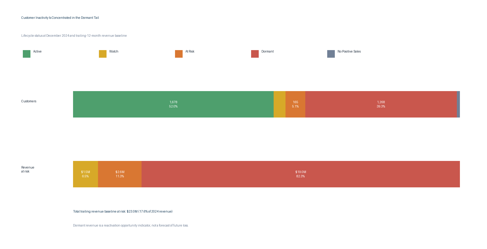

# 4. Customer Lifecycle and Retention Risk

## Executive Question

Which customers appear inactive or at risk of churn, and how much revenue is genuinely associated with that risk?

## Executive Answer

At December 2024, **1,678 customers (51.95%)** had positive sales in the prior three months and were classified as active. Another **263 customers (8.14%)** were in the watch or at-risk windows. The dormant population is large—**1,268 customers (39.26%)**—but its importance is better judged by revenue than by count.

Non-active customers carry **$23.0 million of trailing revenue baseline**, equal to **17.60% of 2024 recognized revenue**. Dormant customers account for **$19.0 million, or 82.27%, of that baseline**. This is a reactivation-opportunity measure: it is the customer’s net revenue in the 12 periods ending with their last positive-sale month, floored at zero. It is not a forecast of future loss, expected lifetime value, or confirmed churn.

## Lifecycle Summary

| Lifecycle status | Customers | Customer share | Revenue at risk | Share of risk | Share of 2024 revenue |
| --- | ---: | ---: | ---: | ---: | ---: |
| Active (0–3 months) | 1,678 | 51.95% | $0.0M | 0.00% | 0.00% |
| Watch (4–6 months) | 98 | 3.03% | $1.5M | 6.47% | 1.14% |
| At Risk (7–12 months) | 165 | 5.11% | $2.6M | 11.26% | 1.98% |
| Dormant (13+ months) | 1,268 | 39.26% | $19.0M | 82.27% | 14.48% |
| No Positive Sales | 21 | 0.65% | $0.0M | 0.00% | 0.00% |



## Segment Priorities

| Customer segment | Risky customers | Risky share of segment | Revenue at risk | Share of risk |
| --- | ---: | ---: | ---: | ---: |
| Independent Retail Accounts | 767 | 46.94% | $9.8M | 42.71% |
| Commercial Service Accounts | 290 | 62.50% | $3.5M | 15.08% |
| Wholesale Trade Accounts | 162 | 45.38% | $2.7M | 11.50% |
| Mid-Size Retail Chain | 30 | 100.00% | $1.5M | 6.43% |
| Regional Retail Chain – Tier 1 | 16 | 100.00% | $1.0M | 4.31% |

The top three segments account for **69.29% of the trailing revenue baseline at risk**. The first outreach wave should therefore combine high-value 7–12 month accounts, where intervention is still timely, with a separate reactivation test for the highest-value dormant accounts.

## Business Interpretation

The 39.26% dormant-customer rate is visually large, but treating every dormant account as equally valuable would waste resources. The portfolio should be managed as a prioritized queue:

1. Contact the highest-baseline customers in the 7–12 month group immediately; these accounts are recent enough for a plausible save motion.
2. Place 4–6 month watch customers into low-cost proactive outreach before they cross the at-risk threshold.
3. Test a limited reactivation campaign for the largest dormant customers and stop low-yield campaigns quickly.
4. Review segments with 100% dormant status to distinguish obsolete historical classifications from recoverable customers.

Positive sales define activity. Returns and credits do not reset the inactivity clock, which avoids classifying a customer as active because of an accounting adjustment. Inactivity also does not prove churn: customer seasonality, planned buying cycles, mergers, class changes, or data-boundary effects may explain the absence of recent sales.

## Method and Assumptions

- Lifecycle status is measured relative to the latest recognized period, `2412`.
- Active: 0–3 months since last positive sale; Watch: 4–6; At Risk: 7–12; Dormant: 13 or more; No Positive Sales: no positive-sale period in the reporting window.
- Revenue at risk is the net recognized revenue in the 12 periods ending with each customer’s last positive-sale period, floored at zero and assigned only to non-active customers.
- The historical class used for segment reporting is the class producing the most positive revenue in the customer’s last active period.
- Current customer master classifications do not overwrite the historical transaction record.

## Reproducible Queries and Outputs

| Purpose | SQL | Result table |
| --- | --- | --- |
| Customer-level lifecycle table | [`04_customer_lifecycle.sql`](sql/04_customer_lifecycle.sql) | [`04_customer_lifecycle.csv`](outputs/04_customer_lifecycle.csv) |
| Lifecycle and revenue-at-risk summary | [`04_retention_summary.sql`](sql/04_retention_summary.sql) | [`04_retention_summary.csv`](outputs/04_retention_summary.csv) |
| Segment-level retention risk | [`04_retention_by_segment.sql`](sql/04_retention_by_segment.sql) | [`04_retention_by_segment.csv`](outputs/04_retention_by_segment.csv) |
| Prioritized 7–12 month outreach list | [`04_priority_outreach.sql`](sql/04_priority_outreach.sql) | [`04_priority_outreach.csv`](outputs/04_priority_outreach.csv) |
| Lifecycle validation checks | [`04_validation_checks.sql`](sql/04_validation_checks.sql) | [`04_validation_checks.csv`](outputs/04_validation_checks.csv) |

Regenerate the outputs and visualization with:

```bash
python scripts/analyze_q2_q4.py
```

## Validation Notes

All Question 4 checks pass: latest period `2412`, one lifecycle record for each of 3,230 customers, lifecycle buckets reconciled to the customer population, 21 customers correctly isolated with no positive sales, zero revenue-at-risk assigned to active customers, and no negative revenue-at-risk values.
